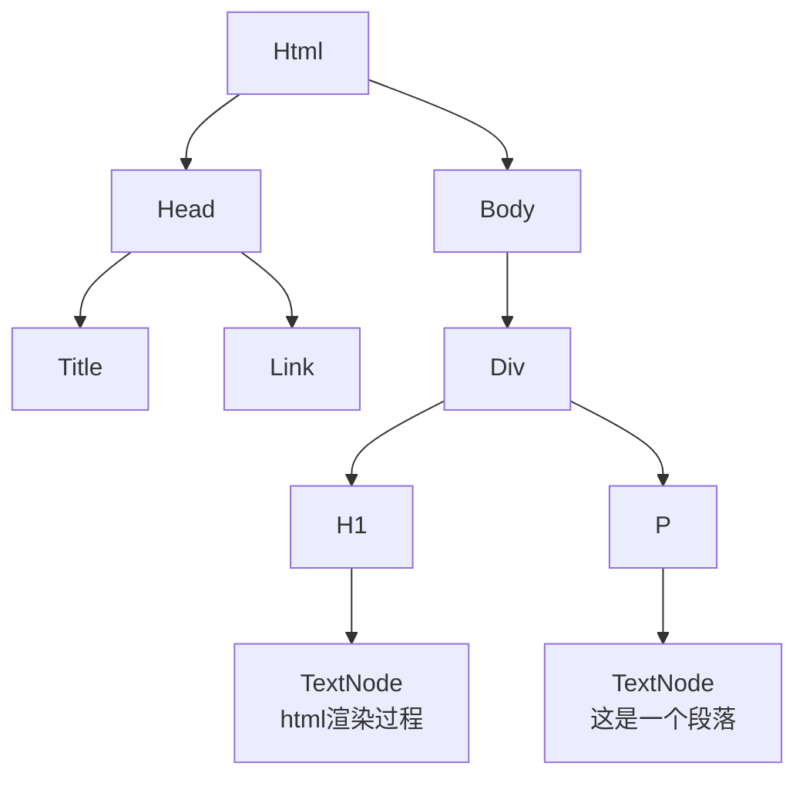
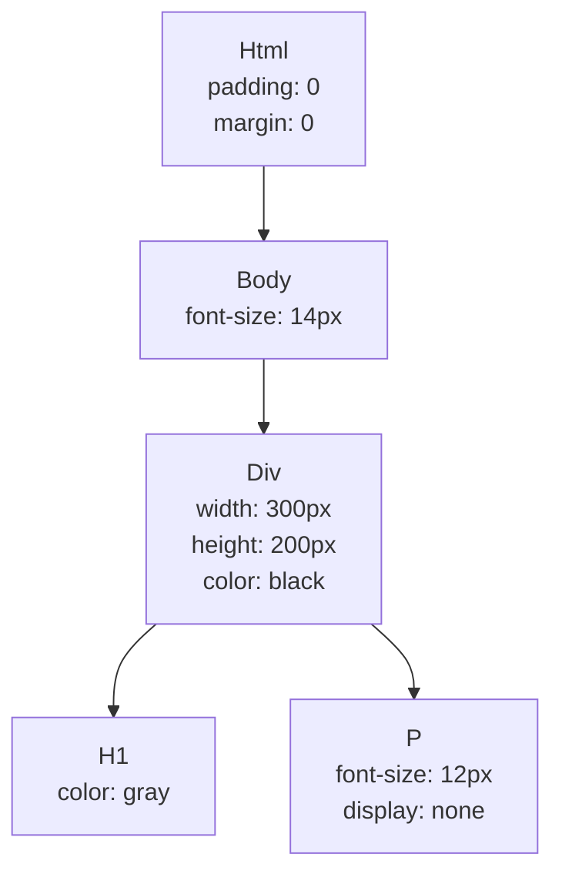
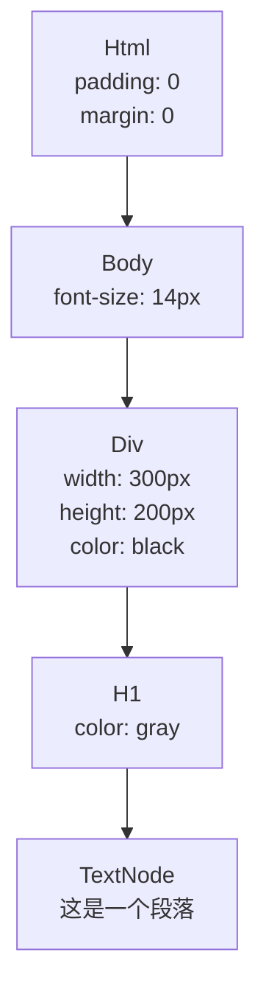

## Html

### 什么是Html
> HTML (HyperText Markup Language) 不是一门编程语言，而是一种用来告知浏览器如何组织页面的标记语言。HTML 可复杂、可简单，一切取决于开发者。它由一系列的元素（elements）组成，这些元素可以用来包围不同部分的内容，使其以某种方式呈现或者工作。 一对标签（ tags）可以为一段文字或者一张图片添加超链接，将文字设置为斜体，改变字号，等等。

``` html
<!DOCTYPE html>
<html lang="en">
  <head>
    <meta charset="utf-8">
    <meta name="viewport" content="width=device-width,initial-scale=1">
    <title></title>
  <link rel="icon" href="./favicon.ico"></head>
  <body>
    <div id="app"></div>
  <script type="text/javascript" src="./assets/js/app.js"></script></body>
</html>
```
上面是一段简单的html示例，一个完整的html文档里面应该包含以下几个部分：
* `<!DOCTYPE html>` 所有HTML文档都必须以<!DOCTYPE>声明开头。该声明不是HTML标记。它是浏览器的“信息”，说明期望的文档类型。
* `<html>` 表示HTML文档的根，所有其他HTML元素的容器。
* `<head>` 是元数据的容器，并且被放置在`<HTML>`标记和`<body>`标记之间。
* `<html>` 表示HTML文档的根，所有其他HTML元素的容器。
* `<meta>` 定义关于HTML文档的元数据。通常用于指定字符集，页面描述，关键字和文档作者设置。
* `<title>` 表示HTML文档的根，所有其他HTML元素的容器。
* `<link>` 外部资源，常用于链接外部css资源。
* `<script>` 外部资源，常用于链接外部js资源。
* `<body>` 包含一个HTML文件中的所有内容，诸如标题，段落，图像，超链接，表格，列表等
* 其他元素，比如 div、p、span


### Html和Css、Javascript
* CSS ，以及如何用它装饰 HTML (例如：更改你的文本字号和字体，添加边框和阴影，将你的页面设计成多栏布局，添加动画和其他视觉效果。)
* JavaScript ，用它为网页添加动态功能(例如：找到你的地址并且在地图上绘制出来，触发按钮时让 UI 元素显示或消失，将用户的数据本地储存在他们的电脑里，以及更多。)


### Element

``` html
<p class="demo">这是一个html的元素</p>
```
1.开始标签（`p class='demo'`）：包含元素的名称（本例为 p），被左、右角括号所包围。表示元素从这里开始。   
2.结束标签（`/p`）：与开始标签相似，只是其在元素名之前包含了一个斜杠。这表示着元素的结尾。     
3.内容（`这是一个html的元素`）：元素的内容，本例中就是所输入的文本本身。    
4.元素（Element）：开始标签、结束标签与内容相结合，便是一个完整的元素。   

> 注： 元素还包含属性，上面的`class='demo'`代表元素的属性，属性写在开始标签中。

### 块级元素和内联元素
> 块级元素在页面中以块的方式出现，相对于前面的内容它会出现在新的一行，其后的内容会被挤到下一行展现。块级元素通常用于展示页面上结构化的内容，例如段落、列表、导航菜单、页脚等等。一个以block形式展现的块级元素不会被嵌套进内联元素中，但可以嵌套在其它块级元素中。   
内联元素通常出现在块级元素中并环绕文档内容的一小部分，而不是一整个段落或者一组内容。内联元素不会导致文本换行。

常见的块元素有：div；p；form；ul；li；ol；dl；hr；table；h1~h6；

常见的内联元素有：a；span；strong；em；br；img；input；label；button；select；textarea；i；


``` html
<span>一号内联元素</span><span>二号内联元素</span>
<p>一号块元素</p>
<p>一号块元素</p>
```
``` webview
<span>一号内联元素</span><span>二号内联元素</span>
<p>一号块元素</p>
<p>二号块元素</p>
```

### 常见元素及属性

* div 最常用的块元素,常用来作为一个容器。
* h1~h6 标题，分别代表一级标题到六级标题
* p 段落，表示文本的一个段落。该元素通常表现为一整块与相邻文本分离的文本，或以垂直的空白隔离或以首行缩进。
* form 表单，表示文档中的一个区域，此区域包含交互控件，用于向 Web 服务器提交信息。
* ul 列表，表示一个内可含多个元素的无序列表或项目符号列表。（常于li元素搭配使用）
* li 列表条目，它必须包含在一个父元素里：一个有序列表(ol)，一个无序列表(ul)，或者一个菜单 (menu)。
* table 表格，元素表示表格数据 — 即通过二维数据表表示的信息。

### Html的渲染
> 渲染器进程的核心工作是将HTML，CSS和JavaScript转换为用户可以与之交互的网页。

上一节我们简单的介绍了从输入一个url到用户看到页面发生了哪些事情，我们知道了从服务器请求到的html会交给浏览器的渲染进程，下面我们来了解下html是如何被渲染的（以下内容基于chrome浏览器）。

#### 关键渲染路径


网页请求从HTML文件请求开始。服务器返回HTML-响应头和数据。然后浏览器开始解析HTML，转换收到的数据为DOM树。或者嵌入的图片引用。有时请求会分割，这意味着解析剩下的HTML会被终止直到重要的资源被处理。浏览器接着解析HTML，发请求和构造DOM直到文件末尾，这时开始构造CSS对象模型。等到DOM和CSSOM完成之后，浏览器构造渲染树，计算所有可见内容的样式，然后开始计算所有渲染树元素的位置和大小。完成之后，页面被渲染完成，或者说是绘制到屏幕上。

#### 构建DOM树
> 这里需要注意的是当解析html遇到了link、script等需要请求外部资源的元素时，会暂停html的解析。

当浏览器读取HTML代码，每当遇到一个HTML元素等html，body，div等，将元素创建为JavaScript对象节点（DOM）。最终，所有HTML元素都将转换为JavaScript对象。由于每个HTML元素都有不同的属性，因此将通过不同的类（构造函数）创建Dom对象。

``` html
<!DOCTYPE HTML>
<html>
<head>
<title>Rendering Test</title>
<!-- stylesheet -->
<link rel="stylesheet" href="./style.css"/>
</head>
<body>
<div class="container">
<h1>html渲染过程</h1>
<p>这是一个段落.</p>
</div>
<!-- script -->
<script src="./main.js"></script>
</body>
</html>
```
上面代码将会渲染如下所示的Dom树



#### 构建CSSDOM树
构建DOM之后，浏览器将从所有源（外部，嵌入，内联，浏览器默认样式表等）读取CSS并构建CSSOM。CSSOM代表CSS对象模型，它是一个类似于DOM的树状结构。
该树中的每个节点都包含CSS样式信息，这些样式信息将应用于它所针对的DOM元素（由选择器指定）。大多数浏览器都带有自己的样式表，浏览器首先通过使用开发者属性提供的CSS覆盖默认样式表来计算DOM元素的最终CSS属性，构造一个节点。

``` css
html {
    padding: 0;
    margin: 0;
}
body {
    font-size: 14px;
}
.container {
    width: 300px;
    height: 200px;
    color: black;
}
.container > h1 {
    color: gray;
}
.container > p {
    font-size: 12px;
    display: none;
}
```



#### 构建渲染树
> 注意，像display:none 的元素会被渲染树忽略掉
渲染树也是一种通过将DOM和CSSOM树组合在一起而构建的树状结构，渲染树每个节点包含Dom和它的样式信息。



#### 布局（Layout）
布局是浏览器计算各元素几何信息的过程: 元素的大小以及在页面中的位置。 根据 CSS、元素的内容或父级元素，每个元素都将有显式或隐含的大小信息。此过程在 Chrome、Opera、Safari 和 Internet Explorer 中称为布局 (Layout)。 在 Firefox 中称为自动重排 (Reflow)，但实际上其过程是一样的。


#### 绘制（Paint）
1. 根据 渲染树 将其分割为多个层。
2. 将每个层绘制进位图中。
3. 将层作为纹理上传至 GPU。
4. 复合多个层来生成最终的屏幕图像。

``` webview
<div webview-dksd2k class="container">
<h1>html渲染过程</h1>
<p>这是一个段落.</p>
</div>
<style>
.container[webview-dksd2k] {
    width: 300px;
    height: 200px;
    color: black;
    background-color: #95a5a6;
    z-index:999;
}
.container[webview-dksd2k] > h1 {
    color: gray;
}
.container[webview-dksd2k] > p {
    font-size: 12px;
    display: none;
}
</style>
```


### Reflow
Reflow（重排）指的是计算页面布局（Layout）。某个节点Reflow时会重新计算节点的尺寸和位置，而且还有可能触其后代节点Reflow, 在这之后再次触发一次Repaint（重绘）。

以下情况会导致回流：

* 调整窗口大小
* 改变字体
* 增加或者移除样式表
* 内容变化
* 激活CSS伪类
* 操作CSS属性
* JavaScript操作DOM
* 计算offsetWidth和offsetHeight
* 设置style属性的值
* CSS3 Animation或Transition  

### Repaint

#### 了解层
> Chrome 中有不同类型的层： RenderLayer(负责 DOM 子树)，GraphicsLayer(负责 RenderLayer 的子树)。我们感兴趣的是后者，因为只有 GraphicsLayer 是作为纹理(texture)上传给 GPU 的。后面我将只用「层」来代表 GraphicsLayer。   
在绘制的流程中，浏览器会把Dom转成层（layer）,我们利用chrome devtool可以观察到页面的层信息。打开chrome的开发者工具 --> More tools --> Layers


